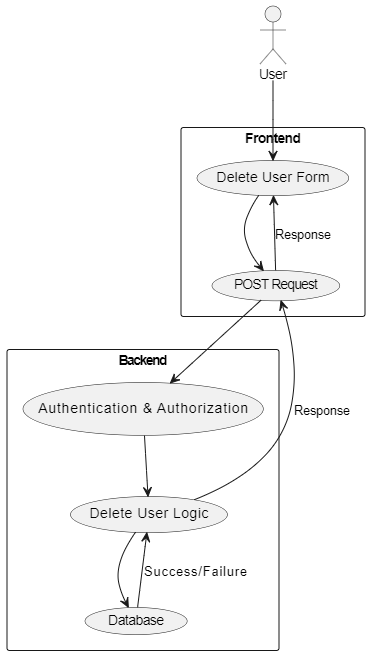

---

# Delete User Functionality: Step-by-Step Guide

This README will guide you through the process of adding a "Delete User" functionality to an Express.js application. The feature allows authenticated users to delete a specified user by their username via a simple web interface.

## **Step 1: Setup Express Server**

1. **Initialize the Express Server**
   - The Express.js framework is used to create a web server.
   - The server listens on port `4001`.

    ```javascript
    const express = require('express');
    const app = express();
    const port = 4001;

    app.use(express.json());
    app.use(express.urlencoded({ extended: true }));

    app.listen(port, () => {
        console.log(`Server is running on http://localhost:${port}`);
    });
    ```

   - **Explanation**: 
     - `express.json()` and `express.urlencoded({ extended: true })` are middlewares to parse JSON and URL-encoded data, respectively.
     - The server starts and logs a message indicating that it's running.

## **Step 2: Authentication and Authorization Middleware**

1. **Create Middleware Functions**
   - Middleware for handling authentication and authorization is set up.
   - These are placeholders and should contain actual logic to verify the user's identity and permissions.

    ```javascript
    const authentication = (req, res, next) => {
        // Authentication logic here
        next();
    };

    const authorisation = ({ isAdmin }) => (req, res, next) => {
        // Authorization logic here, assuming user role checking
        next();
    };
    ```

   - **Explanation**: 
     - `authentication` ensures that only authenticated users can proceed.
     - `authorisation` can check if the user has specific roles, such as admin rights.

## **Step 3: Implement Delete User Functionality**

1. **Create the Delete Function in the Controller**
   - The `delete_user_by_username` function is created to handle the deletion of a user by their username.

    ```javascript
    const delete_user_by_username = async (req, res) => {
        try {
            const { username } = req.body;
            if (!username) {
                return res.status(400).json({ ok: false, message: "Username is required" });
            }

            const result = await UserModel.destroy({
                where: { username }
            });

            if (result === 0) {
                return res.status(404).json({ ok: false, message: "User not found" });
            }

            return res.status(200).json({ ok: true, message: "User deleted successfully" });
        } catch (error) {
            return res.status(500).json({ ok: false, message: "Failed to delete user", error: error.message });
        }
    };
    ```

   - **Explanation**: 
     - The function receives the username from the request body, attempts to delete the user from the database, and returns an appropriate response.
     - If the username is not provided, it returns a 400 error.
     - If no user is found with the given username, it returns a 404 error.
     - On success, it returns a 200 status with a success message.

## **Step 4: Set Up the Route for Deleting Users**

1. **Create a Route to Handle the Deletion Request**
   - A POST route is created to handle requests to delete a user by username.

    ```javascript
    app.post(
        "/auth/delete/user",
        authentication,
        authorisation({ isAdmin: false }),
        (req, res) => delete_user_by_username(req, res)
    );
    ```

   - **Explanation**: 
     - The route `"/auth/delete/user"` is protected by the `authentication` and `authorisation` middlewares.
     - The route calls the `delete_user_by_username` function to process the request.

## **Step 5: Create a Simple Frontend Form**

1. **Serve an HTML Form for User Interaction**
   - A route is created to serve a simple HTML form where users can input a username to delete.

    ```javascript
    app.get('/profile', (req, res) => {
        res.send(`
        <!DOCTYPE html>
        <html lang="en">
        <head>
            <meta charset="UTF-8">
            <meta name="viewport" content="width=device-width, initial-scale=1.0">
            <title>User Profile</title>
        </head>
        <body>
            <h1>User Profile</h1>

            <!-- Form to delete a user by username -->
            <form id="delete-user-form">
                <label for="other-username">Enter Username to Delete:</label>
                <input type="text" id="other-username" name="other-username" required>
                <button type="submit">Delete User</button>
            </form>

            <script>
                document.getElementById("delete-user-form").addEventListener("submit", async (event) => {
                    event.preventDefault();
                    const username = document.getElementById("other-username").value;

                    // Sending a POST request to delete the user by username
                    const response = await fetch('/auth/delete/user', {
                        method: "POST",
                        headers: {
                            "Content-Type": "application/json"
                        },
                        body: JSON.stringify({ username }),
                        credentials: "include"
                    });

                    const result = await response.json();

                    // Handling the response
                    if (result.ok) {
                        alert('User deleted successfully');
                    } else {
                        alert(result.message);
                    }
                });
            </script>
        </body>
        </html>
        `);
    });
    ```

   - **Explanation**: 
     - The `/profile` route serves a simple HTML page with a form that allows the user to input a username to delete.
     - The form submission is handled by JavaScript, which sends a POST request to the backend with the username.


---


**Challenge Part 2: Authentication and Authorization in Delete User Functionality**

**Overview:**
Implementing a "Delete User" functionality in an application typically requires careful consideration of security aspects to prevent unauthorized access and potential misuse. The requirement "This delete user functionality can be done after authentication" means that only authenticated users should be able to perform the delete action. Let's analyze whether this is a good idea and the distinctions between authentication and authorization.

**Authentication vs. Authorization:**

1. **Authentication:**
   - **Definition**: Authentication is the process of verifying the identity of a user or system. It answers the question, "Who are you?"
   - **Purpose**: It ensures that the person or system trying to access a resource is who they claim to be. This is typically achieved through login mechanisms, where users provide credentials such as a username and password.

2. **Authorization:**
   - **Definition**: Authorization is the process of determining whether an authenticated user or system has the necessary permissions to perform a specific action or access a resource. It answers the question, "What can you do?"
   - **Purpose**: It controls what an authenticated user is allowed to do, based on their roles or permissions. For example, an authenticated user may have different access levels, such as read-only or administrative privileges.

**Is It a Good Idea to Allow Deletion Only After Authentication?**

**Pros:**
- **Security**: Requiring authentication before allowing the delete operation ensures that only users who have successfully logged in can attempt to delete a user. This prevents unauthorized access and protects the functionality from being misused by anonymous users.
- **Accountability**: By restricting deletion actions to authenticated users, it becomes easier to track and audit who performed the delete operation. This accountability is crucial for maintaining data integrity and security.

**Cons:**
- **Limited Control**: Authentication alone is not sufficient to control access to sensitive actions like user deletion. While it verifies the user's identity, it does not ensure that the user has the appropriate permissions to perform the action.
- **Potential for Misuse**: If authentication is the only check, any authenticated user could potentially delete users, which might not be desirable. For example, a regular user should not have the ability to delete other users.

**Conclusion:**

Implementing the delete user functionality after authentication is a good practice for ensuring that only verified users can perform the action. However, it is important to also implement authorization checks to ensure that only users with the appropriate permissions (e.g., admins) can actually delete other users. Authentication and authorization are different concepts: authentication verifies identity, while authorization controls access based on that identity.

**Diagram:**

Here's a diagram to illustrate the distinction between authentication and authorization:



